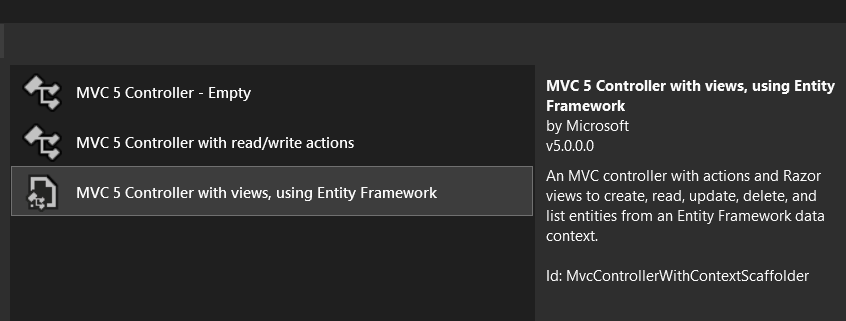

# Employee Management

.Net Framework 4.8 using ADO.NET Entity Data Model

## 1. Database and Tables
Created an `Employee Database` which has only 1 `Table`
- Named `Employee` with the following `Columns`:
    - `ID`: An integer column that represents the employee ID. It is defined as INT and is marked as NOT NULL.
    - `EmpNo`: A varchar column that represents the employee number. It has a maximum length of 6 characters.
    - `FirstNam`e: A varchar column that stores the first name of the employee. It has a maximum length of 15 characters.
    - `LastName`: A varchar column that stores the last name of the employee. It has a maximum length of 15 characters.
    - `Birthdate`: A date column that stores the birthdate of the employee.
    - `ContactNo`: A varchar column that stores the contact number of the employee. It has a length of 11 characters and allows NULL values. I made this varchar because I wanted to show the `+63` `+`  sign, but it was stated on the rules it must start with `09`.
    - `EmailAddress`: A varchar column that stores the email address of the employee. It has a maximum length of 255 characters and allows NULL values.

- Primary Key

    - The primary key for the table is defined on the ID column using the PRIMARY KEY CLUSTERED constraint. This ensures that each row in the table has a `unique ID value`.
    
    
- Unique Constraints:

    - There are `two unique constraints` defined on the table:
    
        - `UC_EmpNo`: This constraint ensures that the EmpNo column values are unique throughout the table. No two rows can have the same EmpNo value.
        - `UC_FirstNameLastName` : This constraint ensures that the combination of FirstName and LastName column values is unique. It prevents the existence of multiple employees with the same first name and last name.

## 2. Models
This was auto generated by the template of the project which is the `ADO.NET Entity Data Model`

## 3. Controllers

Using this MVC controller. Modified some part of the generated code to fit the requirements.

- Rules:

    + EmpNo should be unique
    + No duplicate firstname + lastname combination.
    + Limit firstname and lastname input to 15.
    + Limit contact number input to 11, must start with 09.
    + Handle possible exceptions.

    
## 4. Stored Procedure
Created a stored procedure to populate the database with sample data. 

- The stored procedure is named `sp_PopulateEmployeeTable`.